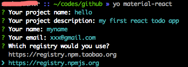

# yeoman

[generator-material-react](https://github.com/leftstick/generator-material-react#readme) 是yeoman脚手架的一个示例项目

## 安装步骤

1. Install yeoman:
    ```JavaScript
    npm install -g yo
    ```

2. Install this:
    ```JavaScript
    npm install -g generator-material-react
    ```

## 使用脚手架

```JavaScript
yo material-react
```


更多调试信息，请参考[generator-material-react](https://github.com/leftstick/generator-material-react#readme)
